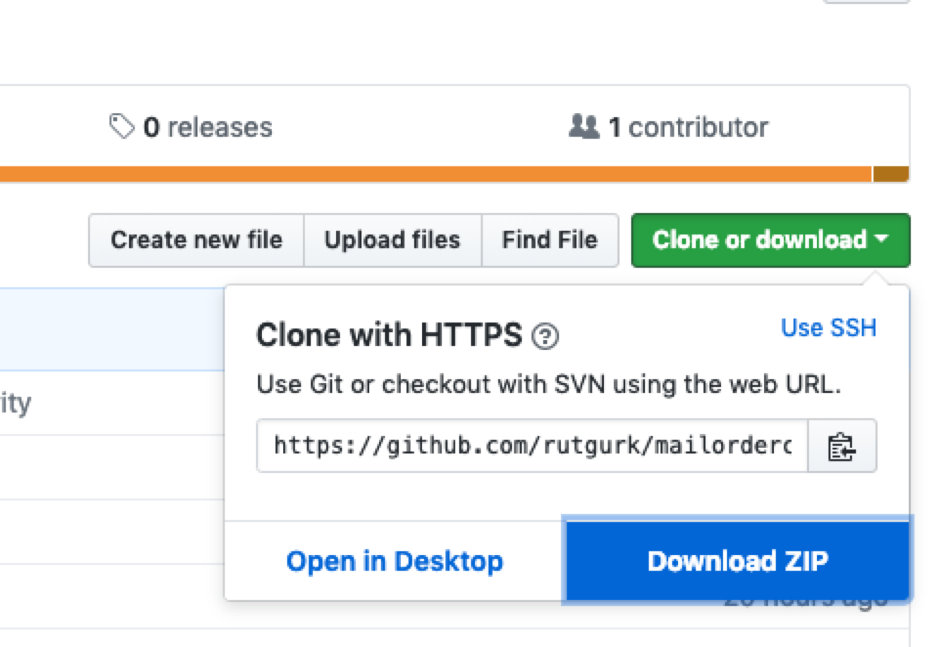
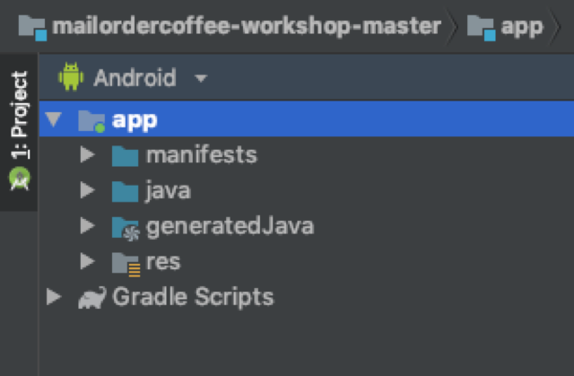

# mailordercoffee-workshop

This Repo contains the source code for the 'Mail Order Coffeeshop app'.
The MailOrder Coffeeshop app was built for Android App test automation practice.
My blog (URL) offers free posts and exercises to help you get started with UI Automation using the Espresso framework.

## Setup

In order to run this app you'll need a way to download this project, an IDE, and a Android device or Emulator.
Using Android Studio and Git is recommended:

### Download the project

If you're familiar with Git, then you should know what to do.
If you aren't familiar with Git you should use the 'Download Zip' option:

When the download is finished you should decompress the Zip to a folder of your own choosing, and then you're all set to open the project.

### Download Android Studio

Android Studio is Google's IDE that's made for Android app development. 

Follow the installation instructions on the Android Studio website:

[https://developer.android.com/studio/install] (https://developer.android.com/studio/install)

### Open the Project in Android Studio

1.	Open android studio
2.	Select "Open an existing Android Studio project"
3.	Browse to the directory where you saved the project and open it:
4.	This is the point where Android Studio may ask you a few questions about the setup of your IDE and/or a few project related questions. If you don't know what to do, most of the time accepting the (default) suggestions is fine.
5.  Time to see if everything works: 
This is what the project structure should look like in Android Studio:


If it doesn't look like this, there are a few thing you can do:

- Check in the bottom bar of Android Studio if Gradle is still syncing, downloading dependencies etc. If it is, wait a few minutes.
- Make sure the project pane is open (click the "1: Project" button on the left side).
- Make sure the 'Android' view is selected in the drop down menu at the top.

If all else fails: 
- From the file menu select Invalidate Caches / Restart.. (and invalidate the caches and restart)
- From the Build menu select Clean Project
- From the build menu select Rebuild project

6.  If you haven't already: setup a device or emulator so you can run the app
7.  Run the app to test if everything was downloaded and imported correctly:
Press the 'play' icon in the top right corner of Android Studio, make sure "app" is selected in the drop-down menu.
 

### Emulator setup

1.	In Android Studio select the Tools menu and then 'AVD Manager'.


2.	Click the '+ Create Virtual Device' button.
3.	Select a device from the list, for example Nexus 5X, and click 'Next'
4.	Select a system image. I'd go with one of the recommended images (Pie, API 28) and click 'Next'
5.	Give the virtual device a name and click 'Finish'

Note: downloading the files for the emulator may take a while.


### Device setup

Developer options on your device should be enabled so we can use usb debug mode and disable animations. Debug mode allows Android Studio to recognize the device, and turning animations off is a recommended practice for mobile test automation. If turned on, animation may cause unexpected delays and test failures.

Instructions may differ for different manufacturers. 
In general, this works*:

1. Open de Settings app;
2. (Android 8.0 or higher) Select system;
3. Scroll to the bottom and select About Phone;
4. Scroll to the bottom and tap Build Number 7 times;
5. Return to the previous screen to find Developer options near the bottom.

*If you're on a different Android version, or your device manufacturer has decided to implement the settings differently, you'll have to Google how to enable the Developer options for your specific device.

Source: https://developer.android.com/studio/debug/dev-options

