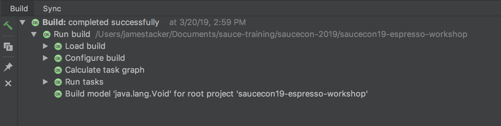

# Espresso SauceCon Workshop

This directory contains example scripts and dependencies for the SauceCon workshop: [Become an Espresso Barista! SauceCon 19 Workshop](https://saucecon.com/). Use these scripts to test your Sauce Labs authentication credentials, setup your automated testing environment, try out Sauce Labs features, and complete the in-class examples. Download the zip file or clone the entire directory to your local environment.

#### For Demonstration Purposes Only

The code in these scripts is provided on an "AS-IS” basis without warranty of any kind, either express or implied, including without limitation any implied warranties of condition, uninterrupted use, merchantability, fitness for a particular purpose, or non-infringement. These scripts are provided for educational and demonstration purposes only, and should not be used in production. Issues regarding these scripts should be submitted through GitHub. These scripts are maintained by the Technical Services team at Sauce Labs.

<br />

## Prerequisites

These procedures will show you to set up a Android Studio environment. The scripts in this repository allow you run a simple automated test to validate your environment and your [saucelabs.com](https://app.saucelabs.com/login) account credentials.
In order to complete these exercises you must complete the following prerequisite installation and configuration steps:

* Install Git
* Install JDK
* Install Gradle
* Install Android Studio
* Setup Project

Once your test environment is up and running, refer to the [exercise guides](exercise-guides/getting-started.md) to begin the exercises.

### Install Git

[Git](https://git-scm.com/doc) is a version control system that lets you check out code from a repository, 
work with that code on your own branch, and then merge that code with any changes that have been made by other developers. 
Git is an essential tool for distributed development teams, and is a critical component of the continuous 
integration/continuous development toolchain.

#### MacOSX:

1. Go to [https://git-scm.com/downloads](https://git-scm.com/downloads).
2. Under **Downloads**, click **Mac OS X**.
3. When the download completes, double-click the `.dmg` file open the installer package.
4. Double-click the installer package to begin the installation.
    > *Security Warning*
    >
    > You may see a warning message that the package can't be opened because it's not from a recognized developer. 
    If this happens, go to System Preferences > Security and Privacy Settings, and click Open Anyway.
5. Click **Continue** for the installation, and enter your local password to authorize the installation.

#### Windows:

1. Go to [https://git-scm.com/downloads](https://git-scm.com/downloads)
2. Under **Downloads**, click on **Windows**.
3. When the dialog opens asking if you want to allow the app to make changes to your device, click Yes.
4. Follow the steps in the setup wizard to complete the installation. You should accept all the default settings.
<br />

### Install the JDK

The [Java SE Developer Kit](http://www.oracle.com/technetwork/java/javase/overview/index.html) lets you develop and 
deploy Java applications on desktops and servers. It is needed to compile our test code.

#### MacOSX:

1. Go to [the JDK downloads](https://www.oracle.com/technetwork/java/javase/downloads/index.html) page, locate the latest release, select the download button.
2. Under **Java SE Development Kit {version}**, select the **Accept License Agreement** radio button.
3. Click the download link for **Mac OS**.
4. When the download completes, double-click the `.dmg` file open the installer package.
Double-click the installer package to begin the installation.

#### Windows:

1. Go to [the JDK downloads](https://www.oracle.com/technetwork/java/javase/downloads/index.html) page, locate the latest release, select the download button.
2. Under **Java SE Development Kit {version}**, select the **Accept License Agreement** radio button.
3. Click the download link for **Windows x64**.
4. When the download completes, double-click the `.exe` file open the installer package.
5. Double-click the installer package to begin the installation. You should accept all the default settings.
<br />

### Install Gradle

[Gradle](https://gradle.org) is a build automation tool used to accelerate your development and deployments. 
It is needed to compile and build our test code.

#### MacOSX:

1. Go to the [Gradle Installation](https://gradle.org/install/) page.
2. Navigate to the section that reads **Install Manually**
3. Click the download link for the **Complete** distribution (includes sources and docs).
4. [Open a Terminal Window](https://macpaw.com/how-to/use-terminal-on-mac) and create the following directory:
    ```
    $ mkdir /opt/gradle
    ```
5. Extract the `zip` archive into that directory:
    ```
    $ unzip -d /opt/gradle gradle-5.3-bin.zip
    ```
6. Set the following system-wide environment variable for `gradle`, then reinitialize your bash session:
    ```
    $ export PATH=$PATH:/opt/gradle/gradle-5.3/bin
    ```
    ```
    $ source ~/.bashrc
    ```
7. Test to ensure the installation worked:
    ```
    $ gradle -v
    ```
    ```
    Welcome to Gradle 5.3!

    Here are the highlights of this release:
        - Feature variants AKA "optional dependencies"
        - Type-safe accessors in Kotlin precompiled script plugins
        - Gradle Module Metadata 1.0

    For more details see https://docs.gradle.org/5.3/release-notes.html
    ```

#### Windows:

1. Create a new directory in the `C:\` drive called `Gradle`
    ```
    > C:\Gradle
    ```
2. Go to the [Gradle Installation](https://gradle.org/install/) page.
3. Navigate to the section that reads **Install Manually**
4. Click the download link for the **Complete** distribution (includes sources and docs).
5. When the download completes, move the `zip` archive into `C:\Gradle`
6. Extract the archive using an [archive tool](https://lifehacker.com/the-best-file-archive-utility-for-windows-5820410) of your choice
7. [Open a Windows Command Prompt](https://www.lifewire.com/how-to-open-command-prompt-2618089) and verify the installation:
    ```
    > gradle -v
    ```
<br />

### Install Android Studio

[Android Studio](https://developer.android.com/studio) is an integrated development environment that incorporates several tools for developing and running Android Applications using Java code. You will be using Android Studio to write and edit the sample scripts used in the exercises.  For these exercises you only need to download the free Community edition.

#### MacOSX:

1. Go to [https://developer.android.com/studio#downloads](https://developer.android.com/studio#downloads)
2. Click the **`android-studio-ide-<version>-mac.dmg`** download link.
3. When the download completes, double-click the .dmg file open the installer package.
4. Double-click the installer package to begin the installation.
5. Drag and drop the Android Studio icon into the **Applications** folder (if necessary)
#### Windows:

1. Go to [https://developer.android.com/studio#downloads](https://developer.android.com/studio#downloads)
2. Click the **`android-studio-ide-<version>-windows.exe`** download link.
3. When the download completes, double-click the `.exe` file to launch the installation wizard. You should accept all the default settings.

#### Complete Installation:
    > Screenshots are from the OSX installation:
1. Open Android Studio and when prompted, select **Do not import settings**, then **OK**:
    
2. Next you may see a prompt for updating, follow that process to return to this page, then select **Next**
    
3. Select the **Standard** installation, then click **Next**
     
<br />

### Import the Project

#### Ensure Android Studio is Correctly Configured:

1. Open Android Studio
2. Select **Import project (Gradle, Eclipse ADT, etc.)**:
    
3. When prompted select the root directory of `saucecon19-espresso-workshop`
4. Android Studio should open and begin downloading the components (via `gradle`):
    
5. After some time, Android Studio begins to setup the project build. Wait for this completion notice in the console:
    
<br />
