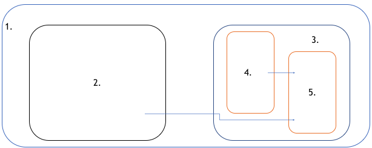
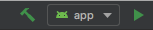
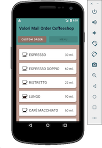
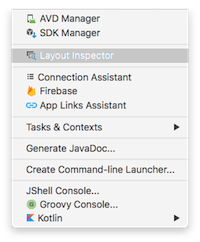
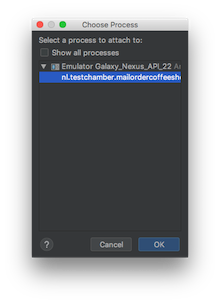
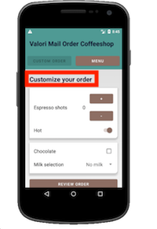
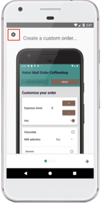
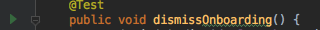
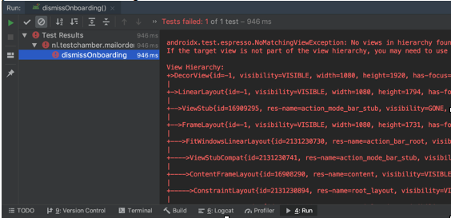
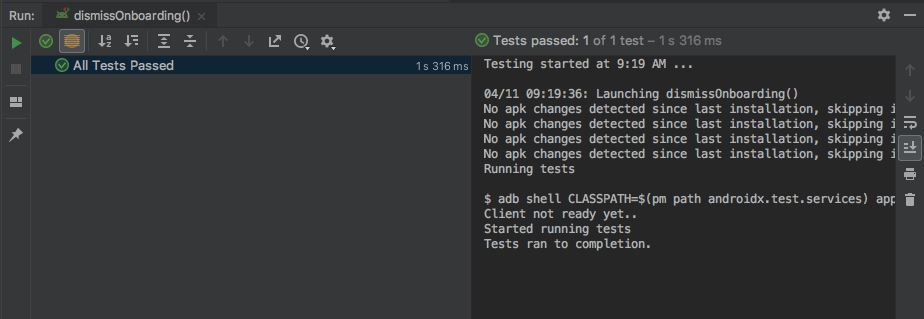

# Exercise 1: Dismiss the Onboarding Screen
**Goals:** 
* Learn how to use the **Layout Inspector**
* Inspect the app UI and locate **IDs** for **Views**.

**Objectives:**
1. Use the **Layout Inspector** to inspect the app UI and find the **`ids`** for the relevant **Views**.
3. Write a test that dismisses the **Onboarding View**

    > You've received a broken test with non existent IDs `example_id` and `another_example_id`
    
<br />

### Info: Terminology

The mobile-app experience differs from its desktop counterpart in that a user's interaction with the app doesn't always begin in the same place. Instead, the user journey often begins non-deterministically. For instance, if you open an email app from your home screen, you might see a list of emails. By contrast, if you are using a social media app that then launches your email app, you might go directly to the email app's screen for composing an email.

The Activity class is designed to facilitate this paradigm. When one app invokes another, the calling app invokes an activity in the other app, rather than the app as an atomic whole. In this way, the activity serves as the entry point for an app's interaction with the user.



###### source: [https://developer.android.com/guide/components/activities.html](https://developer.android.com/guide/components/activities.html)

1. Android OS
2. App X has a button that takes you to the 'compose email screen' in your mail app
3. Mail app
4. `MainActivity` of the App. If you start the app, this is the activity that automatically gets started. It loads your inbox and has a few buttons, for example a 'compose email' button.
5. `ComposeEmailActivity`. This activity allows you to compose an email. If you press the **compose email** button in the `MainActivity`, this gets started. It's also directly accessible by activities from other apps. This means that this activity can also be invoked from App/Activity X in this example.

#### View
To simplify things a bit: everything you see in the UI is basically a **View**. A View occupies a rectangular area on the screen and can be anything such as a `Textview`, `Button`, `EditText`, `ImageView`, `ViewGroup` and more. 

Views are arranged (how and where they are displayed on screen) in a **layout**. A layout (a form of `ViewGroup`) is an invisible container that holds other Views and defines their layout properties.

In short: a View can be a smaller part of the UI you interact with, such as a button or text field, but a View can also be an invisible container that holds other Views and defines their layout properties.

###### source: [https://developer.android.com/reference/android/view/View](https://developer.android.com/reference/android/view/View)

<br />

### Part One: Lauch the Layout Inspector

1. Launch the app by pressing the **play** button. It's in the top right corner of the Android Studio.

    
    
    > Make sure **app** is visible from the drop down menu

2. Use the app to navigate to the screen you'd like to inspect.

    

    > WARNING! Steps 1-2 require an emulator. [Here](https://developer.android.com/studio/run/managing-avds) are instructions on how to configure an emulator through the **AVD Manager**
 
3. Launch the **Layout Inspector**:
    
    
        
4. Select the device and activity you'd like to inspect

    
    
<br />

### Part Two: Find the IDs

1. Re-launch the **Layout Inspector** and find the `ids` of the following **Views**:

    
    

2. Replace the `ids` in the test. The proper formate is `R.id.id_name`.
3. Run the test by pressing the play icon next to the method name:

    
    
<br />

### Troubleshooting
You can view the result of the test run in the bottom left corner. Below is an example of a failing test:
    

    
If you select the failed test on the left, you'll be able to see more detail on the event console to the right. A `NoMatchingViewException` indicates that the selected View was missing. This typically means the View `id` was incorrect or you were looking for the View at the wrong time (i.e. you attempted to look for an `id` from the onboarding screen while the app was already on the custom order screen).

Below is an example of a passing test:



To see the full solution use:
```
$ git checkout exercises/solution_exercise_one
```
