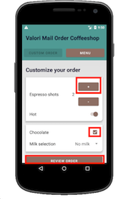
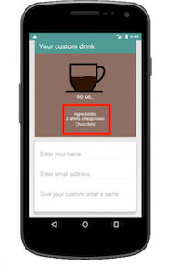

# Exercise 2: Select, Click, and Scroll
**Goals:** 
* Learn to use the Espresso Core API to write a complete test.
* Practice using the Layout Inspector
* Think about (be mindful of) code duplication

**Objectives:**
1. Write a test that creates a custom order that adds:
    * **chocolate** 
    * **two shots of espresso**.
2. Verify the ingredients listed on the **Order Overview** screen contain the correct items.

<br />

### Espresso Core API Cheat Sheet:


###### source: [https://developer.android.com/training/testing/espresso/cheat-sheet](https://developer.android.com/training/testing/espresso/cheat-sheet)

<br />

### Part One: Find the IDs:

1. Checkout branch `exercises/solution_exercise_one`:
    ```
    git checkout exercises/solution_exercise_one
    ```
2. Use the **Layout Inspector** to gather the IDs for the following elements:

 

<br />

### Part Two: Create the Test Method:
1. Write your own test method in `java > nl.testchamber.mailordercoffeeshop (androidTest) > EspressoWorkshopTest.java`.
2. Here is an example test command:
    ```
    onView(R.id.<some_id>)).perform(click(), click());
    ```
3. Add a command that verifys that the **Ingredients List** test matches. For example:
    ```
    onView(withId(R.id.<ingredients_list_id>)).check(matches(withText("<some_text")));
    ```
    
<br />

### Part Three: Verify and Test
1. Save all and hit the play button next to your test method
2. If everything passes, checkout the next branch to see the full solution
    ```
    git checkout exercises/solution_exercise_two
    ```

<br />

### Extra Challenge

If your device is large enough to display the whole screen at once, you don't have to scroll. If you'd like to try it anyway, you can change the device orientation to landscape.

Use the following code:
```
activityTestRule.getActivity().setRequestedOrientation(ActivityInfo.SCREEN_ORIENTATION_LANDSCAPE);
```

Feel free to try to write additional tests using other elements from the **Custom Order** screen.

<br />

