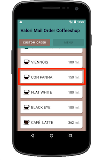

# Exercise 3: Don't Waste Time, Recycle with Espresso
**Goals:** 
* Learn to use `RecyclerViewActions`
* Learn how to construct a matcher for `RecyclerView` items

**Objectives:**
1. Write a test where you select the **"Con Panna"** beverage from the menu. 
2. Verify the beverage name on the **Order Overview** screen.

<br />

### Info: `RecyclerViewActions`

```
actionOnHolderItem(VIEW_HOLDER_MATCHER, VIEW_ACTION)
actionOnItem(VIEW_MATCHER, VIEW_ACTION)
actionOnItemAtPosition(int, VIEW_ACTION)
scrollTo(VIEW_MATCHER)
scrollToHolder(VIEW_HOLDER_MATCHER)
scrollToPosition(int)
```
###### source: [https://developer.android.com/reference/android/support/test/espresso/contrib/RecyclerViewActions](https://developer.android.com/reference/android/support/test/espresso/contrib/RecyclerViewActions)

#### Tip:
If you're looking to match based upon certain properties that are available in the UI (such as ID, Text etc.), you should use a `RecyclerViewAction` that accepts a `ViewMatcher` as an argument. You can use the same `ViewMatchers` as you would when trying to find a View with the `onView()` method.

When constructing the `ViewMatcher` keep in mind that the `RecyclerViewActions` that accepts `ViewMatchers`, expects you to provide a `ViewMatcher` to help it find an item. That means it's looking for the root View of the Layout. 

You can't just provide a matcher that directly matches a nested `TextView` that is part of the item. Instead you'll have to specify its relation to the root View of the item, from the perspective of the root.

<br />

### Part One: Grab the ID of the "Con Panna" Item
1. Open the Layout Inspector and inspect the following **View** and take note of its ID.



> Hint: You'll have to scroll to see this option in your AVD
    
<br />

### Part Two: Create the `RecyclerViewAction`
1. Write a command that navigates to the **Menu View**.
2. Use a `RecyclerViewAction` to locate and `click` on the **"Con Panna"** item. For Example:
    ```
    onView(withId(R.id.recycler_view_id)).perform(RecyclerViewActions.<RecyclerView.ViewHolder>actionOnItem(VIEW_MATCHER, VIEW_ACTION));
    ```
3. Replace the ID in the `onView` matcher with the ID of the `RecyclerView` in the app.
4. Pick a `RecyclerViewAction` and supply the correct `ViewMatcher` to select the **"Con Panna"** item, then pick an action to perform on said item.
4. Run a test. If everything passes checkout the following branch to see the solution:
    ```
    git checkout exercises/solution_exercise_three
    ```
    
<br />

#### Extra Challenge
* Feel free to try to write additional tests. For example: enter text into the edit text fields in the **Order Overview**.